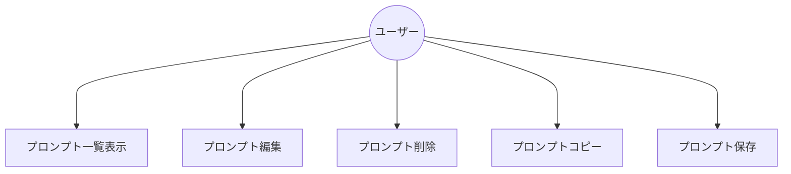

# プロンプト管理アプリ
## ユースケース図

```mermaid
graph TD;
    ユーザー((ユーザー))--->プロンプト一覧表示;
    ユーザー((ユーザー))--->プロンプト編集;
    ユーザー((ユーザー))--->プロンプト削除;
    ユーザー((ユーザー))--->プロンプトコピー;
    ユーザー((ユーザー))--->プロンプト保存;
```

