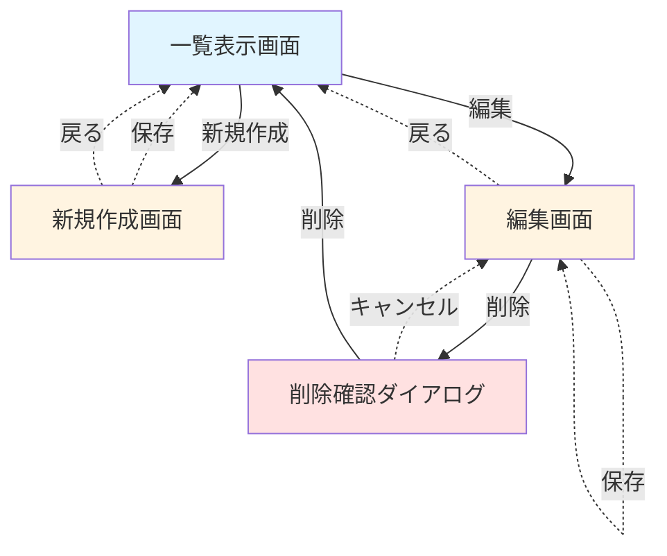

# 画面遷移図

### 画面詳細

| 画面名 | 主要機能 |
|--------|----------|
| 一覧表示 |  一覧表示、新規作成、編集、コピー |
| 新規作成 |  保存、戻る |
| 編集 |  保存、コピー、削除、戻る |

### 補足事項
- 新規作成画面の戻るボタンを押下時には「保存せず戻りますか？」という確認ダイアログを表示する
- 保存ボタンを押下後には「保存しました」というスナックバーを表示する
- コピーボタンを押下後には「コピーしました」というスナックバーを表示する
- 削除ボタンを押下後には「削除しますか？」という削除確認ダイアログを表示する
- 確認ダイアログでは**削除**と**キャンセル**が選択することができる

