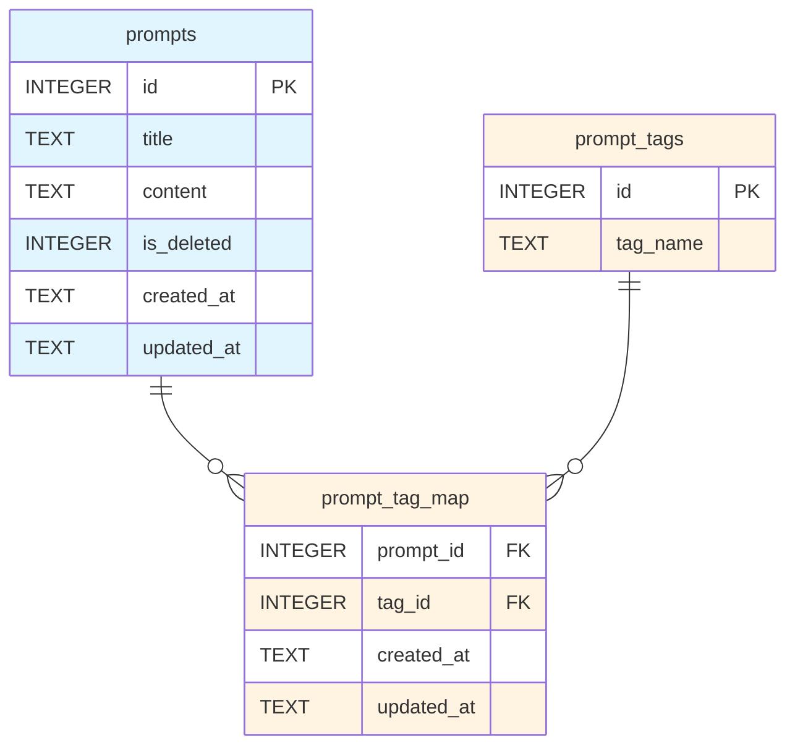

# ER図

```mermaid
erDiagram
    prompts {
        INTEGER id PK
        TEXT title 
        TEXT content
        INTEGER is_deleted
        TEXT created_at
        TEXT updated_at
    }

    prompt_tag_map {
        INTEGER prompt_id FK
        INTEGER tag_id FK
        TEXT created_at
        TEXT updated_at
    }

    prompt_tags {
        INTEGER id PK
        TEXT tag_name 
    }

     prompts ||--o{ prompt_tag_map : ""
     prompt_tags ||--o{ prompt_tag_map : ""

    style prompts fill:#e1f5ff
    style prompt_tag_map fill:#fff4e1
    style prompt_tags fill:#fff4e1
```
### 補足事項
- 論理削除サイン（delete_at） は、0が有効、1が論理削除済み
- **prompt_tag_map** と **prompt_tags** はフェーズ２以降の機能で追加予定