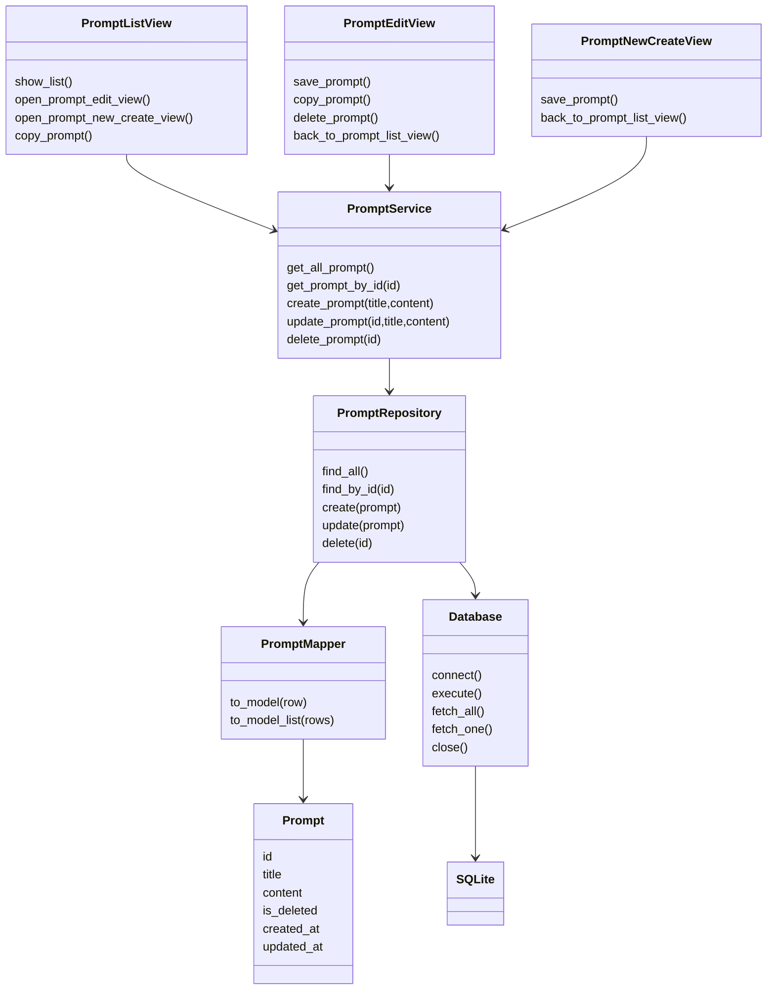

# クラス図

```mermaid
classDiagram
    class PromptListView{
        show_list()
        open_prompt_edit_view() 
        open_prompt_new_create_view()
        copy_prompt()
    }
    class PromptNewCreateView{
        save_prompt()
        back_to_prompt_list_view()
    }
    class PromptEditView{
        save_prompt()
        copy_prompt()
        delete_prompt()
        back_to_prompt_list_view()
    }
    class PromptService{
        get_all_prompt()
        get_prompt_by_id(id)
        create_prompt(title,content)
        update_prompt(id,title,content)
        delete_prompt(id)
    }
    class PromptRepository{
        find_all()
        find_by_id(id)
        create(prompt)
        update(prompt)
        delete(id)
    }

    class PromptMapper{
        to_model(row)
        to_model_list(rows)
    }


    class Prompt{
        id
        title
        content
        is_deleted
        created_at
        updated_at
    }

    class Database{
        connect()
        execute()
        fetch_all()
        fetch_one()
        close()
    }

    class SQLite{

    }

    PromptListView --> PromptService
    PromptEditView --> PromptService
    PromptNewCreateView --> PromptService
    PromptService --> PromptRepository
    PromptRepository --> PromptMapper
    PromptMapper --> Prompt
    PromptRepository --> Database
    Database --> SQLite
    
```