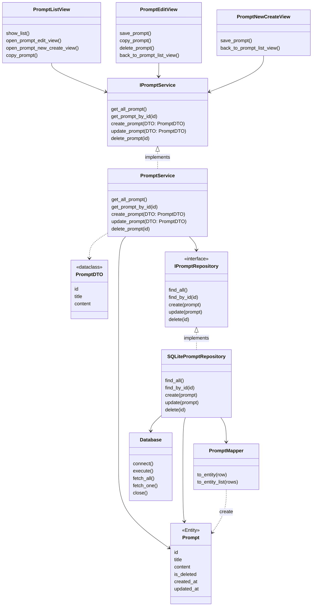

# クラス図

```mermaid
classDiagram
    class PromptListView{
        show_list()
        open_prompt_edit_view() 
        open_prompt_new_create_view()
        copy_prompt()
    }
    class PromptNewCreateView{
        save_prompt()
        back_to_prompt_list_view()
    }
    class PromptEditView{
        save_prompt()
        copy_prompt()
        delete_prompt()
        back_to_prompt_list_view()
    }
    class IPromptService{
        get_all_prompt()
        get_prompt_by_id(id)
        create_prompt(DTO: PromptDTO)
        update_prompt(DTO: PromptDTO)
        delete_prompt(id)
    }

    class PromptService{
        get_all_prompt()
        get_prompt_by_id(id)
        create_prompt(DTO: PromptDTO)
        update_prompt(DTO: PromptDTO)
        delete_prompt(id)
    }

        class PromptDTO{
        <<dataclass>>
        id
        title
        content
    }

    class IPromptRepository{
        <<interface>>
        find_all()
        find_by_id(id)
        create(prompt)
        update(prompt)
        delete(id)
    }


    class SQLitePromptRepository{
        find_all()
        find_by_id(id)
        create(prompt)
        update(prompt)
        delete(id)
    }

    class PromptMapper{
        to_entity(row)
        to_entity_list(rows)
    }


    class Prompt{
         <<Entity>>
        id
        title
        content
        is_deleted
        created_at
        updated_at
    }

    class Database{
        connect()
        execute()
        fetch_all()
        fetch_one()
        close()
    }


    PromptListView --> IPromptService
    PromptEditView --> IPromptService
    PromptNewCreateView --> IPromptService
    IPromptService <|.. PromptService : implements
    PromptService ..> PromptDTO
    PromptService --> Prompt
    PromptService --> IPromptRepository
    IPromptRepository <|.. SQLitePromptRepository : implements
    SQLitePromptRepository --> PromptMapper
    SQLitePromptRepository --> Prompt
    PromptMapper ..> Prompt : create
    SQLitePromptRepository --> Database

    
```

