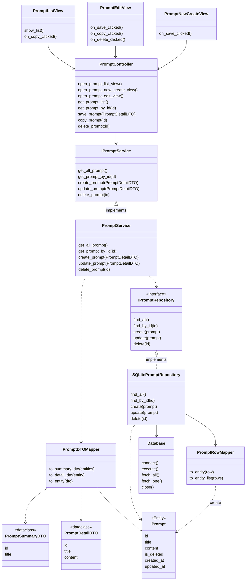

# クラス図

```mermaid
classDiagram
    class PromptListView{
        show_list()
        on_copy_clicked()

    }

    class PromptNewCreateView{
        on_save_clicked()
    }

    class PromptEditView{
        on_save_clicked()
        on_copy_clicked()
        on_delete_clicked()
    }

    class PromptController{
        open_prompt_list_view()
        open_prompt_new_create_view()
        open_prompt_edit_view()
        get_prompt_list()
        get_prompt_by_id(id)
        save_prompt(PromptDetailDTO)
        copy_prompt(id)
        delete_prompt(id)
    }


    class IPromptService{
        get_all_prompt()
        get_prompt_by_id(id)
        create_prompt(PromptDetailDTO)
        update_prompt(PromptDetailDTO)
        delete_prompt(id)
    }

    class PromptService{
        get_all_prompt()
        get_prompt_by_id(id)
        create_prompt(PromptDetailDTO)
        update_prompt(PromptDetailDTO)
        delete_prompt(id)
    }

    class PromptDTOMapper{

        to_summary_dto(entities)
        to_detail_dto(entity)
        to_entity(dto)

    }
        class PromptSummaryDTO{
        <<dataclass>>
        id
        title
    }

        class PromptDetailDTO{
        <<dataclass>>
        id
        title
        content
    }

    class IPromptRepository{
        <<interface>>
        find_all()
        find_by_id(id)
        create(prompt)
        update(prompt)
        delete(id)
    }


    class SQLitePromptRepository{
        find_all()
        find_by_id(id)
        create(prompt)
        update(prompt)
        delete(id)
    }

    class PromptRowMapper{
        to_entity(row)
        to_entity_list(rows)
    }


    class Prompt{
         <<Entity>>
        id
        title
        content
        is_deleted
        created_at
        updated_at
    }

    class Database{
        connect()
        execute()
        fetch_all()
        fetch_one()
        close()
    }


    PromptListView --> PromptController
    PromptEditView --> PromptController
    PromptNewCreateView --> PromptController

    PromptController --> IPromptService
    IPromptService <|.. PromptService : implements
    PromptService ..> PromptDTOMapper

    PromptDTOMapper ..> PromptSummaryDTO
    PromptDTOMapper ..> PromptDetailDTO
    PromptDTOMapper ..> Prompt


    PromptService --> IPromptRepository

    IPromptRepository <|.. SQLitePromptRepository : implements

    SQLitePromptRepository --> PromptRowMapper
    SQLitePromptRepository ..> Prompt
    SQLitePromptRepository --> Database

    PromptRowMapper ..> Prompt : create


```
