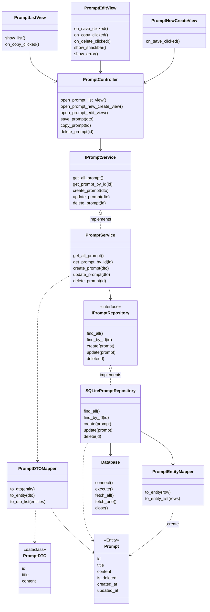

# クラス図

```mermaid
classDiagram
    class PromptListView{
        show_list()
        on_copy_clicked()
    }

    class PromptNewCreateView{
        on_save_clicked()
    }

    class PromptEditView{
        on_save_clicked()
        on_copy_clicked()
        on_delete_clicked()
        show_snackbar()
        show_error()
    }

    class PromptController{
        open_prompt_list_view()
        open_prompt_new_create_view()
        open_prompt_edit_view()
        save_prompt(dto)
        copy_prompt(id)
        delete_prompt(id)
    }


    class IPromptService{
        get_all_prompt()
        get_prompt_by_id(id)
        create_prompt(dto)
        update_prompt(dto)
        delete_prompt(id)
    }

    class PromptService{
        get_all_prompt()
        get_prompt_by_id(id)
        create_prompt(dto)
        update_prompt(dto)
        delete_prompt(id)
    }

        class PromptDTOMapper{
            to_dto(entity)
            to_entity(dto)
            to_dto_list(entities)
        
    }
        class PromptDTO{
        <<dataclass>>
        id
        title
        content
    }

    class IPromptRepository{
        <<interface>>
        find_all()
        find_by_id(id)
        create(prompt)
        update(prompt)
        delete(id)
    }


    class SQLitePromptRepository{
        find_all()
        find_by_id(id)
        create(prompt)
        update(prompt)
        delete(id)
    }

    class PromptEntityMapper{
        to_entity(row)
        to_entity_list(rows)
    }


    class Prompt{
         <<Entity>>
        id
        title
        content
        is_deleted
        created_at
        updated_at
    }

    class Database{
        connect()
        execute()
        fetch_all()
        fetch_one()
        close()
    }


    PromptListView --> PromptController
    PromptEditView --> PromptController
    PromptNewCreateView --> PromptController
    
    PromptController --> IPromptService
    IPromptService <|.. PromptService : implements
    PromptService ..> PromptDTOMapper

    PromptDTOMapper ..> PromptDTO
    PromptDTOMapper ..> Prompt
    
    
    PromptService --> IPromptRepository
    
    IPromptRepository <|.. SQLitePromptRepository : implements

    SQLitePromptRepository --> PromptEntityMapper
    SQLitePromptRepository ..> Prompt
    SQLitePromptRepository --> Database
    
    PromptEntityMapper ..> Prompt : create
    

    
```
