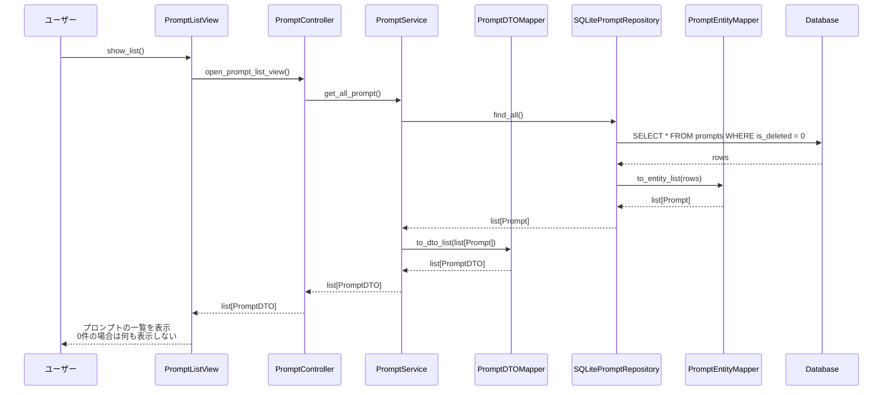
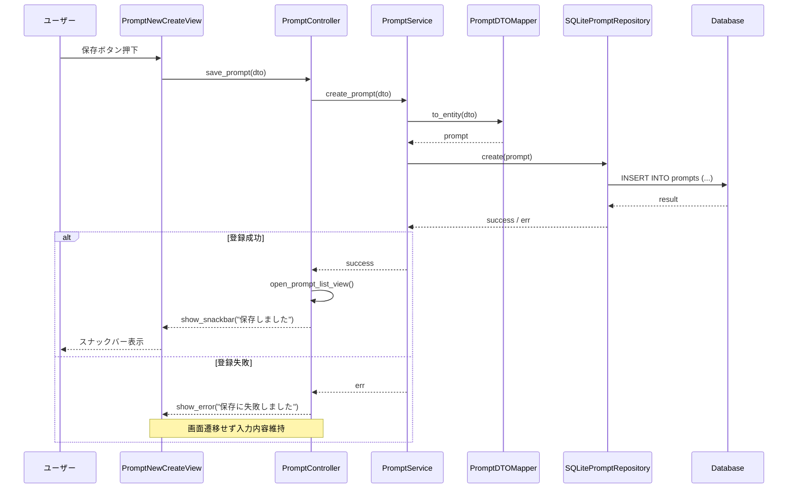
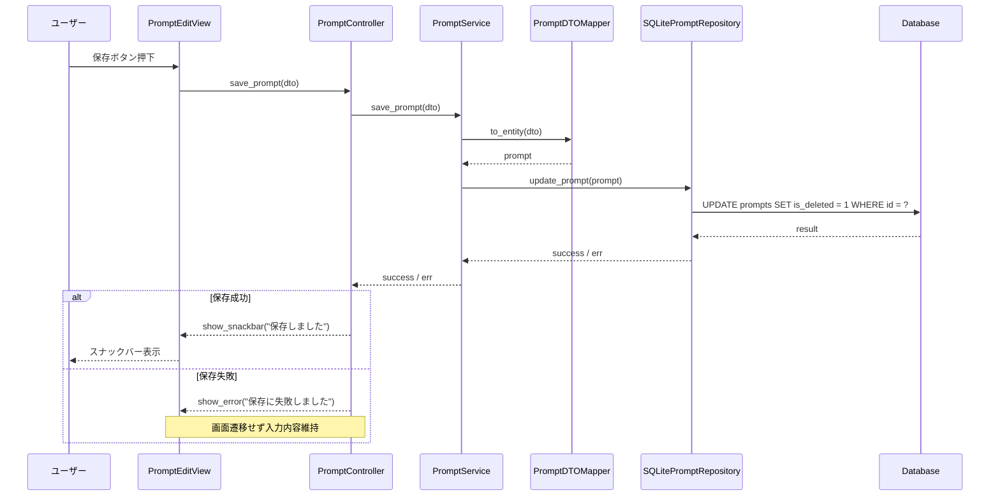
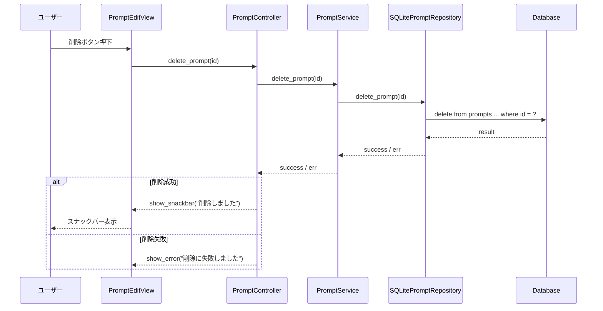

# シーケンス図
## 一覧表示

```mermaid
sequenceDiagram
participant user as ユーザー
participant view as PromptListView
participant ctrl as PromptController
participant service as PromptService
participant dto_mapper as PromptDTOMapper
participant repository as SQLitePromptRepository
participant row_mapper as PromptEntityMapper
participant db as Database

    user ->> view: show_list()
    view ->> ctrl: open_prompt_list_view()
    ctrl ->> service : get_all_prompt()
    service ->> repository : find_all()
    repository ->> db : SELECT * FROM prompts WHERE is_deleted = 0
    db -->> repository : rows

    repository ->> row_mapper : to_entity_list(rows)
    row_mapper -->> repository : list[Prompt]
    repository -->> service : list[Prompt]
    service ->> dto_mapper : to_dto_list(list[Prompt])
    dto_mapper -->> service : list[PromptDTO]

    service -->> ctrl : list[PromptDTO]
    ctrl -->> view :    list[PromptDTO]
    view -->> user: プロンプトの一覧を表示<br>0件の場合は何も表示しない
```

## 保存（新規作成）

```mermaid
sequenceDiagram
participant user as ユーザー
participant view as PromptNewCreateView
participant ctrl as PromptController
participant service as PromptService
participant dto_mapper as PromptDTOMapper
participant repository as SQLitePromptRepository
participant db as Database

    user ->> view: 保存ボタン押下
    view ->> ctrl: save_prompt(dto)

    ctrl ->> service: create_prompt(dto)

    service ->> dto_mapper: to_entity(dto)
    dto_mapper -->> service: prompt

    service ->> repository: create(prompt)
    repository ->> db: INSERT INTO prompts (...)
    db -->> repository: result
    repository -->> service: success / err

    alt 登録成功
        service -->> ctrl: success
        ctrl ->> ctrl: open_prompt_list_view()
        ctrl -->> view: show_snackbar("保存しました")
        view -->> user: スナックバー表示
    else 登録失敗
        service -->> ctrl: err
        ctrl -->> view: show_error("保存に失敗しました")
        Note over ctrl,view: 画面遷移せず入力内容維持
    end
```

## 保存（編集）

```mermaid
sequenceDiagram
participant user as ユーザー
participant view as PromptEditView
participant ctrl as PromptController
participant service as PromptService
participant dto_mapper as PromptDTOMapper
participant repository as SQLitePromptRepository
participant db as Database

    user ->> view: 保存ボタン押下
    view ->> ctrl: save_prompt(dto)

    ctrl ->> service: save_prompt(dto)

    service ->> dto_mapper: to_entity(dto)
    dto_mapper -->> service: prompt

    service ->> repository: update_prompt(prompt)
    repository ->> db: UPDATE prompts SET is_deleted = 1    WHERE id = ?;
    db -->> repository: result
    repository -->> service: success / err

        service -->> ctrl: success / err
    alt 保存成功
        ctrl -->> view: show_snackbar("保存しました")
        view -->> user: スナックバー表示
    else 保存失敗
        ctrl -->> view: show_error("保存に失敗しました")
        Note over ctrl,view: 画面遷移せず入力内容維持
    end
```
## 削除

```mermaid
sequenceDiagram
participant user as ユーザー
participant view as PromptEditView
participant ctrl as PromptController
participant service as PromptService
participant repository as SQLitePromptRepository
participant db as Database


    user ->> view: 削除ボタン押下
    
    view ->> ctrl: delete_prompt(id)
    
    
    
    ctrl ->> service: delete_prompt(id)

    service ->> repository: delete_prompt(id)

    repository ->> db: delete from prompts  ... where id = ?;
    
    db -->> repository: result
    repository -->> service: success / err

        service -->> ctrl: success / err
    alt 削除成功
        ctrl -->> view: show_snackbar("削除しました")
        view -->> user: スナックバー表示
    else 削除失敗
        ctrl -->> view: show_error("削除に失敗しました")
    end

```
## コピー (一覧表示)
```mermaid
```

## コピー (編集)
```mermaid
```
