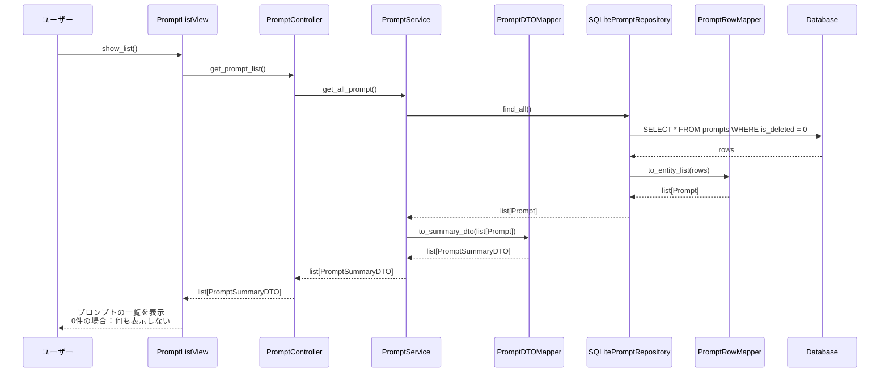
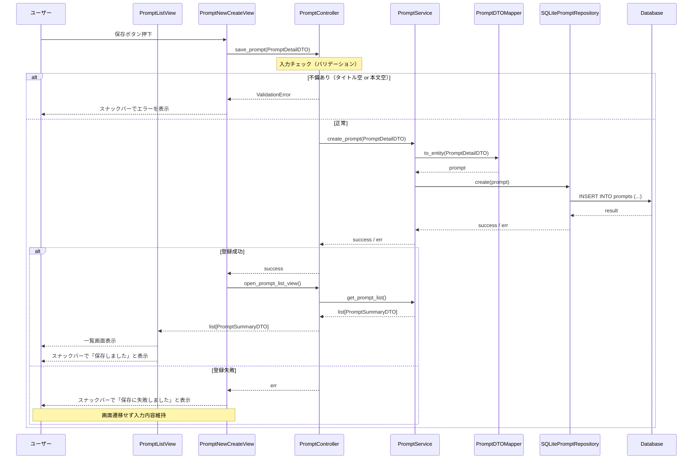
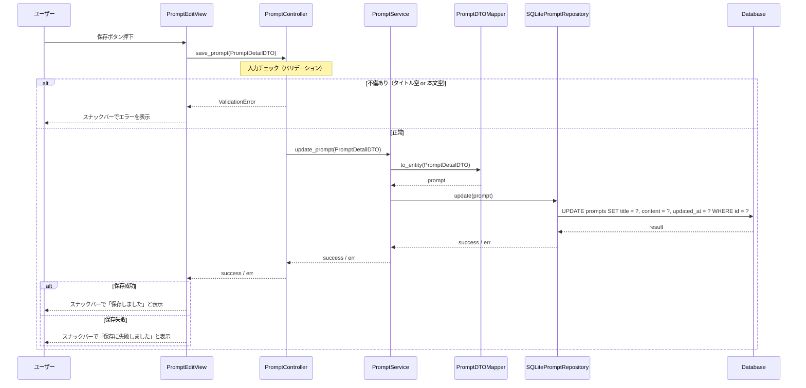
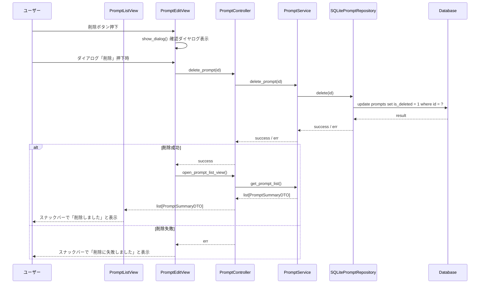
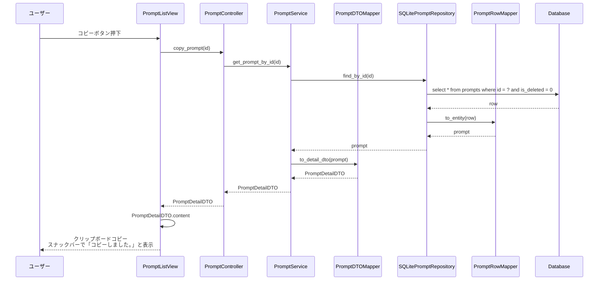
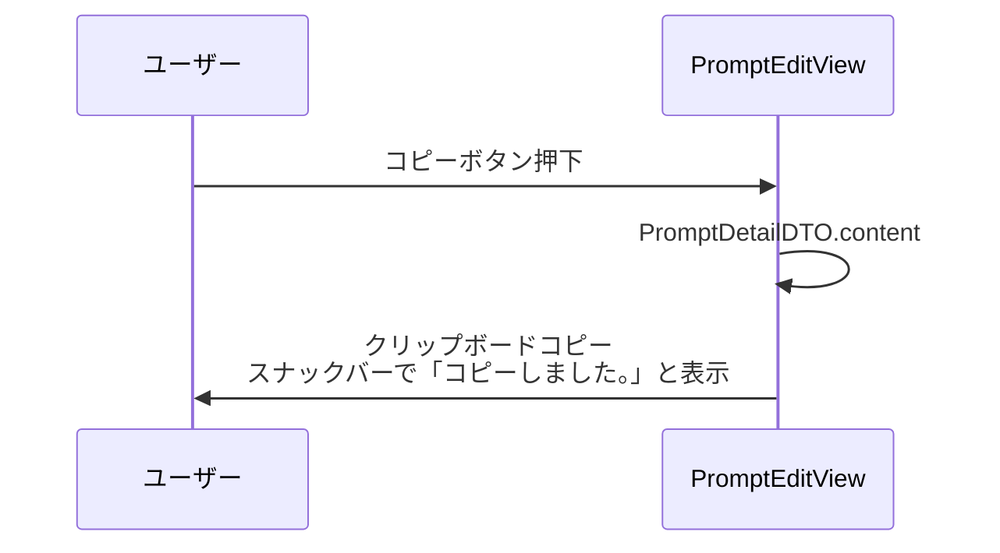
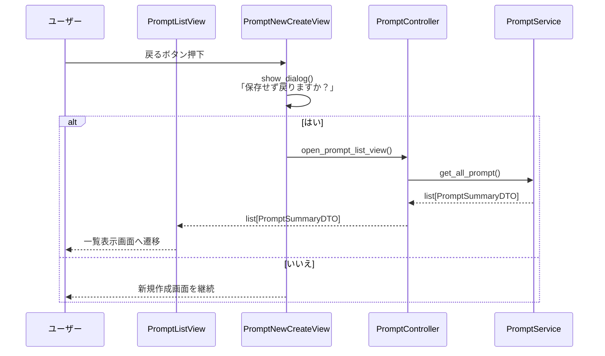
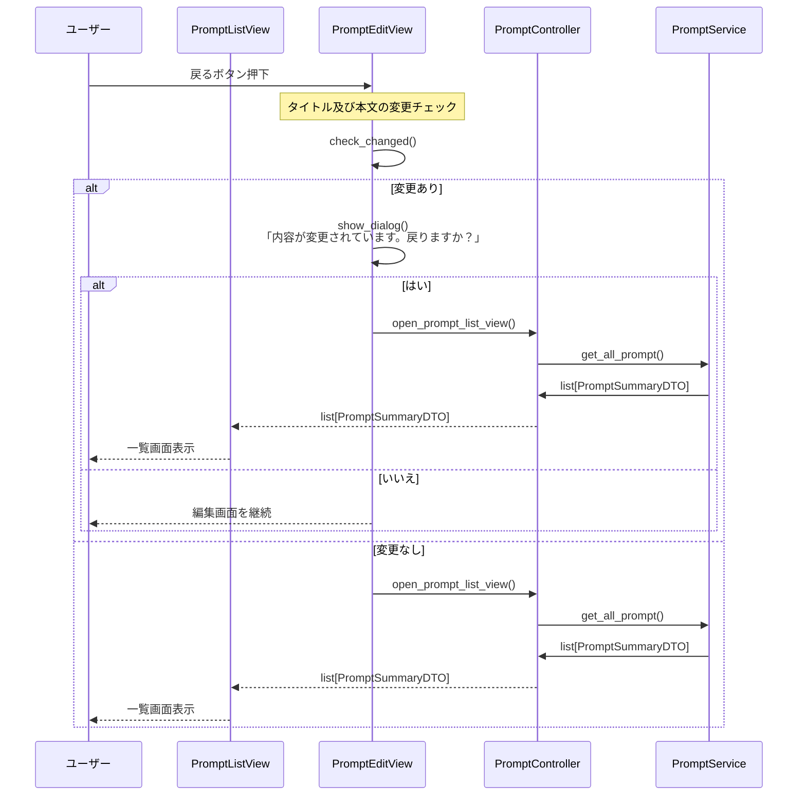

# シーケンス図

## 一覧表示

```mermaid
sequenceDiagram
participant user as ユーザー
participant view as PromptListView
participant ctrl as PromptController
participant service as PromptService
participant dto_mapper as PromptDTOMapper
participant repository as SQLitePromptRepository
participant row_mapper as PromptRowMapper
participant db as Database

    user ->> view: show_list()
    view ->> ctrl: get_prompt_list()
    ctrl ->> service : get_all_prompt()
    service ->> repository : find_all()
    repository ->> db : SELECT * FROM prompts WHERE is_deleted = 0
    db -->> repository : rows

    repository ->> row_mapper : to_entity_list(rows)
    row_mapper -->> repository : list[Prompt]
    repository -->> service : list[Prompt]
    service ->> dto_mapper : to_summary_dto(list[Prompt])
    dto_mapper -->> service : list[PromptSummaryDTO]

    service -->> ctrl : list[PromptSummaryDTO]
    ctrl -->> view :    list[PromptSummaryDTO]
    view -->> user: プロンプトの一覧を表示<br>0件の場合：何も表示しない
```

## 保存（新規作成画面）

```mermaid
sequenceDiagram
participant user as ユーザー
participant list_view as PromptListView
participant view as PromptNewCreateView
participant ctrl as PromptController
participant service as PromptService
participant dto_mapper as PromptDTOMapper
participant repository as SQLitePromptRepository
participant db as Database

user ->> view: 保存ボタン押下
view ->> ctrl: save_prompt(PromptDetailDTO)

Note over ctrl: 入力チェック（バリデーション）
alt 不備あり（タイトル空 or 本文空）
    ctrl -->> view: ValidationError
    view -->> user : スナックバーでエラーを表示
else 正常
    ctrl ->> service: create_prompt(PromptDetailDTO)

    service ->> dto_mapper: to_entity(PromptDetailDTO)
    dto_mapper -->> service: prompt

    service ->> repository: create(prompt)
    repository ->> db: INSERT INTO prompts (...)
    db -->> repository: result
    repository -->> service: success / err
    service -->> ctrl: success / err

    alt 登録成功
        ctrl -->> view: success

        view ->> ctrl: open_prompt_list_view()
        ctrl ->> service: get_prompt_list()
        service -->> ctrl: list[PromptSummaryDTO]
        ctrl -->> list_view: list[PromptSummaryDTO]

        list_view -->> user: 一覧画面表示
        list_view -->> user: スナックバーで「保存しました」と表示

    else 登録失敗
        ctrl -->> view: err
        view -->> user: スナックバーで「保存に失敗しました」と表示
        Note over view,user: 画面遷移せず入力内容維持
    end
end
```

## 保存（編集画面）

```mermaid
sequenceDiagram
participant user as ユーザー
participant view as PromptEditView
participant ctrl as PromptController
participant service as PromptService
participant dto_mapper as PromptDTOMapper
participant repository as SQLitePromptRepository
participant db as Database

    user ->> view: 保存ボタン押下
    view ->> ctrl: save_prompt(PromptDetailDTO)

    Note over ctrl: 入力チェック（バリデーション）
alt 不備あり（タイトル空 or 本文空）
    ctrl -->> view: ValidationError
    view -->> user : スナックバーでエラーを表示
else 正常

    ctrl ->> service: update_prompt(PromptDetailDTO)

    service ->> dto_mapper: to_entity(PromptDetailDTO)
    dto_mapper -->> service: prompt

    service ->> repository: update(prompt)
    repository ->> db: UPDATE prompts SET title = ?, content = ?, updated_at = ? WHERE id = ?;
    db -->> repository: result
    repository -->> service: success / err

        service -->> ctrl: success / err
        ctrl -->> view: success / err

    alt 保存成功
        view -->> user: スナックバーで「保存しました」と表示
    else 保存失敗
        view -->> user: スナックバーで「保存に失敗しました」と表示
    end
end
```

## 削除

```mermaid
sequenceDiagram
participant user as ユーザー
participant list_view as PromptListView
participant view as PromptEditView
participant ctrl as PromptController
participant service as PromptService
participant repository as SQLitePromptRepository
participant db as Database


user ->> view: 削除ボタン押下
view ->> view: show_dialog() :確認ダイヤログ表示

user ->> view: ダイアログ「削除」押下時

view ->> ctrl: delete_prompt(id)

ctrl ->> service: delete_prompt(id)

service ->> repository: delete(id)

repository ->> db: update prompts set is_deleted = 1 where id = ?

db -->> repository: result
repository -->> service: success / err

service -->> ctrl: success / err

alt 削除成功
    ctrl -->> view: success
    view ->> ctrl: open_prompt_list_view()
    ctrl ->> service: get_prompt_list()
    service -->> ctrl: list[PromptSummaryDTO]
    ctrl -->> list_view: list[PromptSummaryDTO]
    list_view -->> user: スナックバーで「削除しました」と表示

else 削除失敗
    ctrl -->> view: err
    view -->> user: スナックバーで「削除に失敗しました」と表示
end

```

## コピー (一覧表示画面)

```mermaid
sequenceDiagram
participant user as ユーザー
participant view as PromptListView
participant ctrl as PromptController
participant service as PromptService
participant dto_mapper as PromptDTOMapper
participant repository as SQLitePromptRepository
participant row_mapper as PromptRowMapper
participant db as Database


    user ->> view: コピーボタン押下

    view ->> ctrl: copy_prompt(id)


    ctrl ->> service: get_prompt_by_id(id)
    service ->> repository: find_by_id(id)

    repository ->> db: select * from prompts where id = ? and is_deleted = 0;

    db -->> repository: row

    repository ->> row_mapper: to_entity(row)

    row_mapper -->> repository: prompt

    repository -->> service: prompt

    service ->> dto_mapper : to_detail_dto(prompt)

    dto_mapper -->> service : PromptDetailDTO


    service -->> ctrl: PromptDetailDTO
    ctrl -->> view: PromptDetailDTO

    view ->> view: PromptDetailDTO.content
    view -->> user: クリップボードコピー<br>スナックバーで「コピーしました。」と表示
```

## コピー (編集)

```mermaid
sequenceDiagram
participant user as ユーザー
participant view as PromptEditView


    user ->> view: コピーボタン押下
    view ->> view: PromptDetailDTO.content

    view ->> user: クリップボードコピー<br>スナックバーで「コピーしました。」と表示
```

## 戻る（新規作成画面）

```mermaid
sequenceDiagram
participant user as ユーザー
participant list_view as PromptListView
participant create_view as PromptNewCreateView
participant ctrl as PromptController
participant service as PromptService

user ->> create_view: 戻るボタン押下
create_view ->> create_view: show_dialog()<br>「保存せず戻りますか？」

alt はい
    create_view ->> ctrl: open_prompt_list_view()


    ctrl ->> service: get_all_prompt()
    service -->> ctrl: list[PromptSummaryDTO]

    ctrl -->> list_view: list[PromptSummaryDTO]
    list_view -->> user: 一覧表示画面へ遷移

else いいえ
    create_view -->> user: 新規作成画面を継続
end
```

## 戻る（編集画面）

```mermaid
    sequenceDiagram
participant user as ユーザー
participant list_view as PromptListView
participant edit_view as PromptEditView
participant ctrl as PromptController
participant service as PromptService

    user ->> edit_view: 戻るボタン押下
    Note over edit_view:タイトル及び本文の変更チェック
    edit_view ->> edit_view: check_changed()

alt 変更あり
    edit_view ->> edit_view: show_dialog()<br>「内容が変更されています。戻りますか？」

    alt はい
        edit_view ->> ctrl: open_prompt_list_view()
        ctrl ->> service: get_all_prompt()
        service ->> ctrl: list[PromptSummaryDTO]

        ctrl -->> list_view: list[PromptSummaryDTO]
        list_view -->> user: 一覧画面表示
    else いいえ
        edit_view -->> user: 編集画面を継続
    end

else 変更なし
    edit_view ->> ctrl: open_prompt_list_view()
    ctrl ->> service: get_all_prompt()
    service ->> ctrl: list[PromptSummaryDTO]
    ctrl -->> list_view: list[PromptSummaryDTO]
    list_view -->> user: 一覧画面表示
end
```
