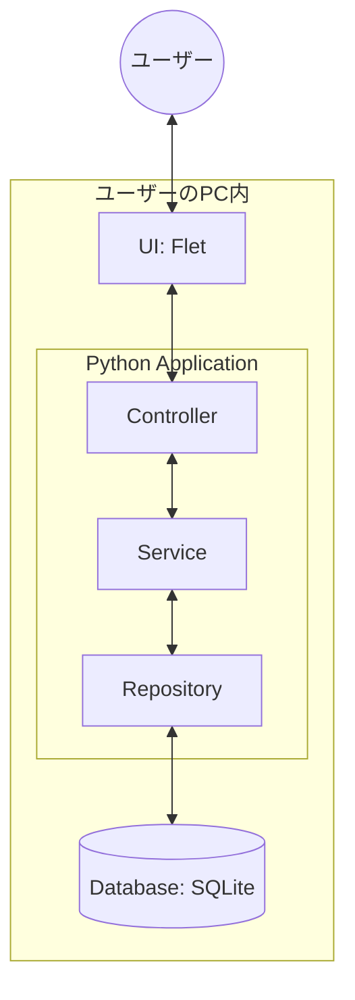

# システム構成図

```mermaid
graph TD
    A((ユーザー))
    B[UI: Flet]

    subgraph PC [ユーザーのPC内]
        B

        subgraph APP [Python Application]
            C[Controller]
            D[Service]
            E[Repository]
        end

        F[(Database: SQLite)]
    end

    A <--> B
    B <--> C
    C <--> D
    D <--> E
    E <--> F
```
