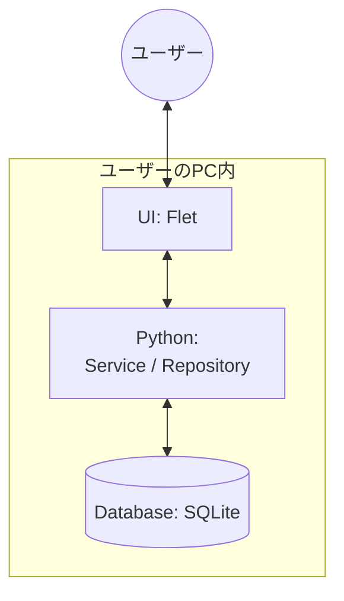

# システム構成図

```mermaid
graph TD;
    A((ユーザー))
    B[UI: Flet]
    C[Python:<br> Service / Repository]
    D[(Database: SQLite)]

    A <--> B
    subgraph PC [ユーザーのPC内]
        B <--> C
        C <--> D
    end
```

